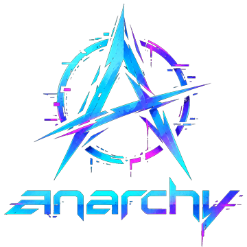
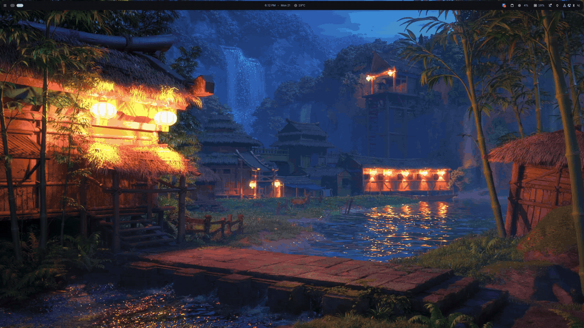
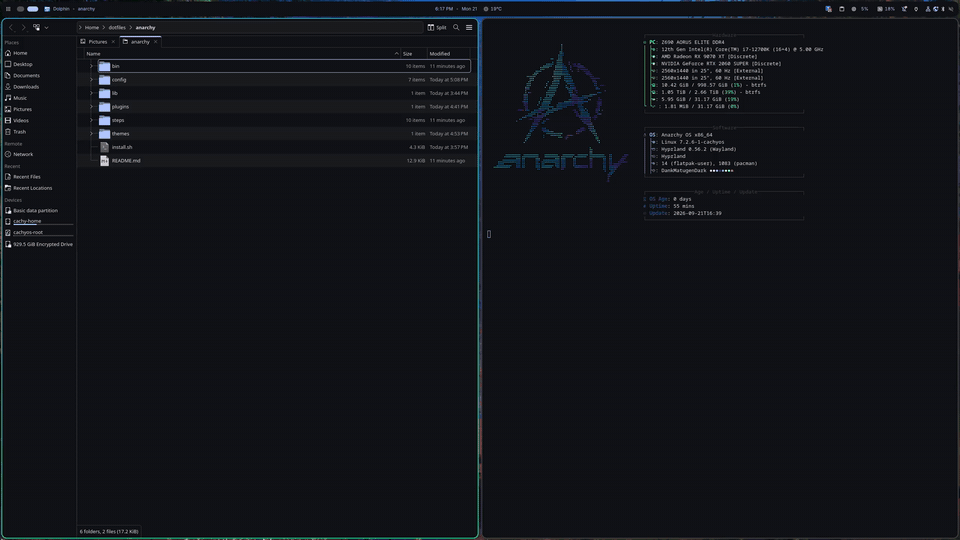
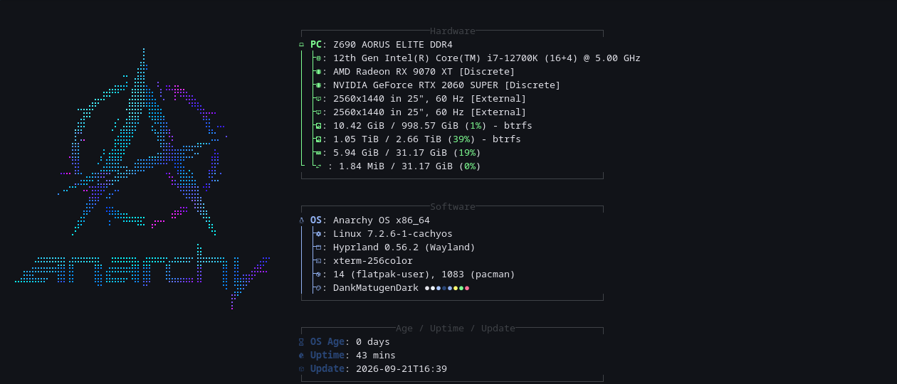
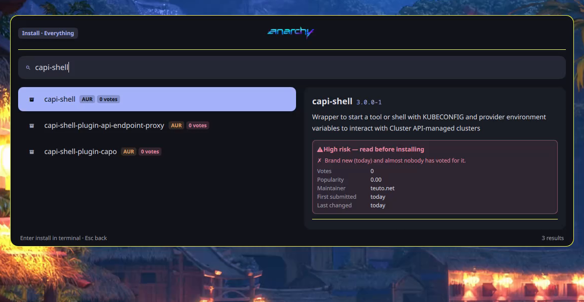

<p align="center">
  
</p>

<p align="center">
  <b>A Hyprland desktop for Arch and CachyOS that gets out of your way.</b><br>
  Vim keys everywhere. A launcher that finds, installs, removes — and vets — your software.<br>
  Screenshots and screen recording with audio. One theme switch that reaches every app.
</p>

<p align="center">
  <a href="#install">Install</a> ·
  <a href="#keybindings">Keys</a> ·
  <a href="#the-launcher">Launcher</a> ·
  <a href="#aur-trust-check">AUR trust check</a> ·
  <a href="#layout">Layout</a>
</p>

```bash
git clone https://github.com/schneipp/dotfiles ~/dotfiles && ~/dotfiles/anarchy/install.sh
```

---

## Tour

### One key for everything

`Super+Space` opens straight into search. Type and the menu and your apps are
searched together — `fire` finds Firefox, `shut` finds the power menu. Every
screen is a keystroke away: apps, capture, install, remove, style, setup,
update, system.

<p align="center"></p>

The wallpaper picker previews as you move. And yes, the capture menu at the end
really does show **● REC**: it noticed that this GIF was being recorded, and
offers to stop it.

### Install anything, and see what you're installing

Search the official repos and the AUR at once. Every result says where it comes
from, and AUR results show their votes. Highlight one to see its description,
size, licence and dependencies.

<p align="center"></p>

AUR packages get a **trust check** — green, amber or red, with the reasons.
`signal-desktop-beta-bin` is green: 8 years old, 44 votes, one maintainer
throughout, downloads only from signal.org. The last package is red for a
different reason: it was submitted *today* and nobody has voted for it yet.
That isn't an accusation, just a reason to read it before you run it.
[What it checks →](#aur-trust-check)

### Tiling with vim keys

`h j k l` move focus, add `Shift` to move the window, `Alt` to resize, `Ctrl` to
hop between monitors. Push a window past the edge of a screen and it lands on
the next one.

<p align="center"></p>

### One switch, every app

Light or dark reaches the whole desktop in one go: the bar, foot, kitty, GTK
apps, and KDE apps like Dolphin. No restarts. It works through a
small watcher that picks up every theme change DankMaterialShell makes and
passes it on to the apps DMS doesn't theme itself.

<p align="center"></p>

### A logo in every terminal

The actual artwork as braille text art, 96 dots across in the logo's own
colours. It's plain text, so it shows in foot, kitty, a TTY or over SSH.

<p align="center"></p>

---

## Install

```bash
git clone https://github.com/schneipp/dotfiles ~/dotfiles
cd ~/dotfiles/anarchy
./install.sh
```

Log into Hyprland afterwards. If you're already in a Hyprland session, everything
except the autostart entries applies immediately.

### Before you commit to it

```bash
./install.sh --dry-run      # print every change, touch nothing
./install.sh --list         # show the steps
```

### Piecemeal

Steps are independent and re-runnable:

```bash
./install.sh packages       # just the packages
./install.sh hyprland       # just the keybindings and window rules
./install.sh theme shell    # several at once
```

Every step is safe to run twice. Existing real files are moved aside as
`<name>.pre-anarchy.<timestamp>` before anything is linked over them, and files
already pointing at this repo are left alone.

### Headless, over RDP

For a machine with no screen: a server, a VM, the box under the desk.

```bash
./installer-headless-rdp.sh                                 # two 1920x1080 monitors
./installer-headless-rdp.sh --monitors "2560x1440 1920x1080"
./installer-headless-rdp.sh --rdp-only                      # desktop already installed
./installer-headless-rdp.sh --dry-run
```

It runs `install.sh`, then adds:

- **[hypr-rdp](https://github.com/MuNeNICK/hypr-rdp)**: an RDP server that talks
  to Hyprland directly, with H.264 (VA-API when there is a GPU), audio,
  clipboard and file copy.
- **One virtual monitor per remote screen**: `anarchy-rdp` creates a headless
  Hyprland output for each entry in `~/.config/anarchy/rdp.conf`, lays them out
  side by side, and serves each on its own port (3389, 3390, …).
- **Autologin**: greetd starts Hyprland at boot, so there is a desktop to
  connect to. The installer asks before it replaces your display manager.
- **No sleep**: it asks before masking suspend and hibernate. It also opens
  the ports in ufw or firewalld when one of them is running.

Hyprland sees the virtual monitors as real ones. Each gets its own workspaces
and bar, and `Super+Ctrl+h/l` and the window-move keys work across them as on a
desk. On the client, open one connection per monitor and make each full screen
on its own display:

```bash
xfreerdp3 /v:host:3389 /u:$USER /cert:tofu /f /monitors:0 /dynamic-resolution:off
xfreerdp3 /v:host:3390 /u:$USER /cert:tofu /f /monitors:1 /dynamic-resolution:off
```

On Windows, open one `mstsc` per port and put each one full screen on its own
display. `anarchy-rdp status` prints these commands filled in for your machine.

```bash
anarchy-rdp status      # outputs, ports, connect commands
anarchy-rdp restart     # after editing rdp.conf
anarchy-rdp password    # the RDP password (separate from your Linux one)
```

Hyprland's portal has no RemoteDesktop interface, so the usual servers can't be
used here: krdp and gnome-remote-desktop need that interface, and xrdp serves
only X11. That leaves hypr-rdp. It is young and it comes from the AUR, and the
installer shows you its trust report before building it.

### Requirements

Arch or an Arch derivative (CachyOS is what this was built on) with `pacman`, and
Hyprland **0.56 or newer** — the config uses the Lua format, not the old `.conf`
one. Start Hyprland once before installing so it writes its default
`~/.config/hypr/hyprland.lua`; the installer appends a single `require("custom")`
line to it rather than replacing it.

---

## Keybindings

`SUPER` is the modifier throughout.

### Windows

| Key | Action |
|-----|--------|
| `Super` + `h/j/k/l` | Focus left / down / up / right |
| `Super+Shift` + `h/j/k/l` | Move the window — crosses to the next monitor at a screen edge |
| `Super+Ctrl` + `h/l` | Focus the previous / next monitor |
| `Super+Ctrl+Shift` + `h/l` | Send the window to the previous / next monitor |
| `Super+Alt` + `h/j/k/l` | Resize |
| `Super+W` | Close the window |
| `Super+F` | Fullscreen |
| `Super+Shift+Return` | Maximize, keeping the bar and gaps |
| `Super+V` | Toggle floating |
| `Super+T` | Toggle split direction (dwindle) |
| `Super` + `1…0` | Switch workspace (`+Shift` moves the window there) |

### Launching

| Key | Action |
|-----|--------|
| `Super+Space` | The anarchy menu |
| `Super+Tab` | Window overview |
| `Super+Return` | Terminal (foot) |
| `Super+Shift+F` | File manager |
| `Super+Shift+B` | Browser |
| `Super+Shift+O` | Obsidian |
| `Super+Shift+I` | Jump straight to the package installer |
| `Super+Shift+C` | Jump straight to the capture menu |
| `Super+Shift+W` | Jump straight to the wallpaper picker |
| `Super+Shift+P` | Jump straight to the power menu |

Any screen can be opened directly:

```bash
qs -c launcher ipc call launcher go wallpaper
# root apps capture managers remove style theme wallpaper setup update system
```

### Capture

| Key | Action |
|-----|--------|
| `Print` | Select an area → straight to the clipboard |
| `Shift+Print` | Select an area → clipboard **and** `~/Pictures/Screenshots` |
| `Super+Print` | The whole focused monitor |
| `Super+Shift+R` | Record a region with desktop audio — press again to stop |

### Session

| Key | Action |
|-----|--------|
| `Super+Shift+M` | Quit Hyprland |

`Super+M` is deliberately **unbound**. Stock Hyprland quits the session on a bare
`Super+M`, which is far too easy to hit by accident.

---

## The launcher

`Super+Space` opens a menu rather than a wall of application icons:

```
    Apps        Launch an application
    Capture     Screenshots and screen recording
    Install     Add a package from a repository
    Remove      Uninstall a package
    Style       Theme, wallpaper and night mode
    Setup       Settings and config files
    Update      Refresh packages
    System      Lock, suspend, reboot, shut down
```

| Key | Action |
|-----|--------|
| any key | Search — at the root this matches the menu *and* your applications |
| `Enter` | Activate |
| `Esc` | Back one screen, then close |
| `Backspace` | Back one screen, when the search box is empty |
| `↑` `↓`, `Ctrl+K` `Ctrl+J`, `Ctrl+P` `Ctrl+N` | Move |
| `Delete` | **In Apps:** uninstall the package that owns the highlighted entry |

### Installing

**Install** searches as you type. With `paru` or `yay` installed it searches the
official repos and the AUR together by default — `Esc` steps back to the source
picker if you want to narrow it to one or the other. The highlighted package's description,
version, size, licence, URL and dependencies appear in a pane beside the list.
`Enter` hands the install to a floating terminal so pacman can ask for your
password and show its own progress.

### AUR trust check

The AUR is user-submitted and nobody reviews it. Every result is labelled with
where it comes from, and AUR results also show their vote count — `0 votes` in
red.

Highlighting an AUR package runs `qsl-aur-audit` and shows a green, amber or red
verdict with its reasons.

<p align="center"></p>
 It checks for the three shapes real AUR malware has
taken:

- **Nobody has vouched for it.** Brand new with almost no votes, or no votes at
  all.
- **It changed hands.** It's orphaned, or the maintainer is no longer the
  original submitter. A handover followed by a fresh upload is how several
  genuine AUR compromises happened.
- **The build does something it shouldn't.** The PKGBUILD and any `.install`
  script are scanned for downloads piped into a shell, decoded base64 blobs,
  bare-IP or paste-site URLs, setuid bits, writes to your shell startup files,
  and skipped checksums. The offending lines are shown.

It also compares the name with the official repos, so a one-letter look-alike
such as `firefx` for `firefox` is flagged as a possible typosquat. It lists every
domain the package downloads from, so you can see where the binary really comes
from.

The same report prints in the terminal before an AUR install. A high-risk
package needs an explicit `y` to go ahead.

These are warning signs, not proof. A clean report doesn't make a package safe,
and a new one isn't necessarily malicious. Read the PKGBUILD when it matters;
paru offers it before every build.

### Uninstalling

Two routes, both ending at the same confirmation:

- **Apps → `Delete`** resolves the entry's `.desktop` file to its owning package
  with `pacman -Qoq`. Entries no package owns — hand-made launchers, web apps —
  are detected separately and offer to delete just the `.desktop` file.
- **Remove** lists every explicitly-installed package.

Nothing is removed without two confirmations: one in the launcher, then pacman's
own after it prints the full list of packages that would go.

### Terminal

foot is the default, and what `xdg-terminal-exec` resolves to. `Ctrl+Up` and
`Ctrl+Down` change the font size, `Ctrl+0` resets it — the same keys kitty gets.

kitty is still installed: it is the only terminal here that speaks its own
graphics protocol, which some TUIs want.

### Style

**Wallpaper** lists everything under `~/Pictures/wallpapers`,
`~/.local/share/wallpapers` and `/usr/share/backgrounds`, with a live preview of
the highlighted image beside the list. Type to filter by filename; `Enter`
applies it. Next / previous / clear sit at the top of the list and disappear once
you start filtering. Point it elsewhere with `ANARCHY_WALLPAPER_DIR`.

**Light / dark** flips the whole desktop palette — the shell, GTK apps and Qt/KDE
apps together. **Colours** opens DMS's accent-colour settings, and **Toggle bar**
hides or shows the topbar.

#### Making a theme reach everything

DankMaterialShell templates a fixed list of apps and stops there. Two things it
leaves undone are what made Omarchy's theme switching feel complete: the KDE
colour scheme that KDE apps actually read, and reloading programs that are
already running.

`anarchy-theme-apply` closes both. It writes foot's palette, applies the KDE
scheme with `plasma-apply-colorscheme`, nudges the GTK colour-scheme preference
so libadwaita apps repaint, and sends `SIGUSR1` to foot, kitty, mako and btop.

`anarchy-theme.path` watches `~/.cache/DankMaterialShell/dms-colors.json` — which
DMS rewrites on every theme, wallpaper and light/dark change — and runs it. So a
theme change propagates on its own, with nothing to remember.

foot's colours are generated rather than included from DMS: foot rejects an
unknown section in an included file and then refuses to start at all, so the
format is worth owning. The script validates with `foot --check-config` and
rolls back if what it wrote would not parse.

#### Colour schemes

`themes/osaka-jade.json` carries Omarchy's Osaka Jade across as a full Material
role set, dark and light. Point DMS at one:

```bash
dms ipc call settings set customThemeFile ~/dotfiles/anarchy/themes/osaka-jade.json
dms ipc call settings set currentThemeName custom
```

DMS takes the source colours from the file and derives the rest through matugen,
so the palette stays internally consistent rather than being applied literally.

### Capture

Screenshots freeze the screen with `hyprpicker` while you select, so nothing
shifts under the cursor. A bare click snaps to the window or monitor underneath
instead of capturing two stray pixels.

Recording uses `gpu-screen-recorder` (falling back to `wf-recorder`) and can
include desktop audio, microphone audio, or both — merged into one track, since
most players only play the first of several. Files land in `~/Videos/Recordings`.
While a recording is running the capture menu shows a **● REC** badge and offers
*Stop recording* at the top.

---

## Layout

```
anarchy/
├── install.sh                  entry point
├── installer-headless-rdp.sh   install.sh + RDP, autologin, no sleep
├── lib/common.sh               logging, backup, symlink and pacman helpers
├── steps/                      one file per concern, run in filename order
│   ├── 10-packages.sh
│   ├── 20-hyprland.sh          keybindings, input, autostart, window rules
│   ├── 30-quickshell.sh        the launcher and its backend scripts
│   ├── 40-fastfetch.sh         system summary with the anarchy logo
│   ├── 45-foot.sh              the default terminal
│   ├── 50-kitty.sh             theme include and font-size keys
│   ├── 60-theme.sh             dark Qt/KDE palettes + theme propagation
│   ├── 70-shell.sh             bash aliases and functions
│   ├── 80-webapps.sh           standalone browser windows
│   ├── 90-plugins.sh           DankMaterialShell plugins
│   └── headless/               only run by installer-headless-rdp.sh
│       ├── 10-rdp.sh           hypr-rdp, anarchy-rdp, password, firewall
│       └── 20-session.sh       greetd autologin, sleep targets
├── plugins/                    DankMaterialShell plugins (see their READMEs)
│   └── spotmarchy/             Spotify + time-synced lyrics, ported from Omarchy
├── themes/                     colour schemes
├── docs/                       the images in this README
├── config/                     symlinked into ~/.config
│   ├── hypr/custom.lua         everything Hyprland
│   ├── quickshell/launcher/    the launcher itself (QML)
│   ├── fastfetch/              system summary with the anarchy logo
│   ├── foot/                   terminal config
│   ├── systemd/                the theme-change watcher
│   ├── rdp/                    anarchy-rdp and hypr-rdp config templates
│   └── bash/                   aliases, functions, shell setup
└── bin/                        symlinked into ~/.local/bin
    ├── qsl-pkg                 package queries, install and removal
    ├── qsl-aur-audit           trust check for AUR packages
    ├── qsl-capture             screenshots and recording
    ├── qsl-wall                wallpaper discovery
    ├── anarchy-rdp             virtual monitors + one RDP server each
    ├── anarchy-theme-apply     push a theme into apps DMS does not reach
    ├── anarchy-logo-braille    turn the artwork into braille text art for fastfetch
    ├── launch-webapp           standalone browser windows
    └── transcode               ffmpeg wrapper for sharing video and images
```

`config/hypr/custom.lua` is loaded **last** from `hyprland.lua`, so it overrides
everything the distro's autogenerated config sets above it.

### Per-machine display layout

`config/hypr/monitors.lua.example` is *copied* to `~/.config/hypr/monitors.lua`
rather than symlinked, because no two machines have the same outputs. Edit your
copy freely — the installer won't overwrite it. It's loaded with `pcall`, so a
missing file or a disconnected output is harmless.

```bash
hyprctl monitors        # see what you've actually got
```

---

## Notes

**Qt and KDE apps.** DankMaterialShell exports a palette to GTK and Qt apps based
on a light/dark flag in its session state. If that flag says light, apps like
Dolphin open white while the shell itself stays dark. The theme step forces dark
and applies the KDE colour scheme DMS generates, so KDE apps follow too.

**Web apps** need a Chromium-family browser — `--app=` is the flag that produces a
chrome-less window, and Firefox has no equivalent. Install `brave-browser`,
`chromium`, or similar; `launch-webapp` picks up whichever it finds.

**AUR.** Install `paru` or `yay` and the launcher grows a second install source
automatically. No configuration needed.
