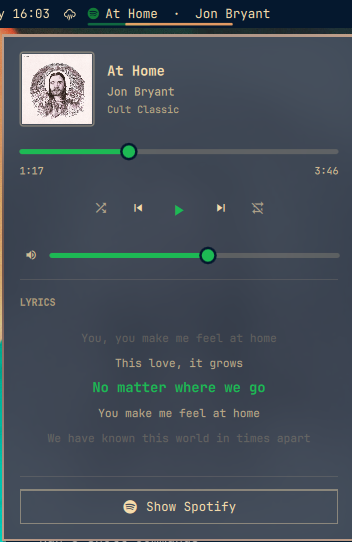

# Spotmarchy Lyrics

Spotify in the [Omarchy](https://omarchy.org) bar, with the lyrics.

A fork of [mich-nduka/spotmarchy](https://github.com/mich-nduka/spotmarchy) that
adds time-synced lyrics to the panel. Everything else is upstream's.

The bar widget is the track, scrolling only as far as it has to, over a hairline
of progress. The panel is the player: cover, seek, transport, shuffle, repeat,
volume, and the words — on a background made from the album cover itself,
measured and scrimmed so the artwork comes through without the text paying for
it.



## Install

```sh
omarchy plugin add https://github.com/schneipp/omarchy-spotmarchy-lyrics-plugin.git --enable
```

Nothing else is required to play music. Spotify is reached over MPRIS
(`org.mpris.MediaPlayer2.spotify`) through Quickshell's own service, so there is
no `playerctl` polling and nothing to configure. The headless clients,
`spotifyd` and `spotify-player`, are matched too.

Cover art wants `magick` (the `imagemagick` package) and `curl`. Without them
the panel keeps its plain theme background and shows no cover at all — the
plugin never loads artwork itself, for reasons in the section below. Lyrics want
`curl` and a network; without either, the panel simply says it found none.

## Usage

Click the track to open or close the panel. Right-click plays and pauses,
middle-click skips, and scrolling over the widget moves through the queue.

| Action | Mouse |
|--------|-------|
| Open / close the panel | Click |
| Play / pause | Right-click |
| Next track | Middle-click |
| Previous / next | Scroll |

Scrolling is read as a gesture rather than as a stream of events, because those
are very different things on the two devices that produce them. A touchpad
swipe skips exactly one track however far the fingers travel, and the kinetic
tail after they lift is ignored; a mouse wheel skips one track per detent. Set
`scrollAction` to `Volume` and both go continuous instead, which is the point of
a volume gesture.

Left click is handled through the bar's own pointer layer. The bar overlays
every widget slot to support drag-to-reorder and forwards a left click only to a
slot exposing `triggerPress(button)` — the same check that decides whether the
cursor turns into a pointing hand. So the widget implements that rather than
catching left clicks in a `MouseArea` of its own. Right and middle clicks are
not accepted by the bar layer and fall through.

A title too wide for the bar rests at its start and pans only across the
overflow, pausing at both ends, so a glance always catches the beginning of a
track rather than whatever the middle of a scroll happens to be showing.

## Lyrics

The panel scrolls the words with the song: one line lit at a time, held on the
centre line, with the lines either side of it fading out towards the edges of
the view rather than stopping at a border. Clicking a line seeks to it — the
timings are already there, so they may as well be a way to move around a track.

Spotify publishes no lyrics over MPRIS and none through any public API, so they
come from [LRCLIB](https://lrclib.net), an open, keyless database of LRC files.
The player supplies the clock and LRCLIB supplies the words; the join between
them is one binary search per position tick. While lyrics are following a track
the panel re-reads the MPRIS position five times a second instead of twice,
because a line either lands on the beat or lands wrong.

A track is looked up twice at most: the exact endpoint first, which matches on
duration and so answers for the recording that is actually playing, then a
search if that misses — once as titled, and once with the edition suffix
removed, since LRCLIB's copy of a song is rarely called *2011 Remaster*. Where
several recordings come back, the one with real timings wins, and among those
the one whose length is closest to what is playing, which is what separates the
album cut from the single edit. A track with only unsynced lyrics still shows
them, as a page to scroll rather than a line to follow.

Every answer is cached under `$XDG_CACHE_HOME/spotmarchy/lyrics`, including
*there are none* — a track played twice should not be two requests to a
volunteer-run service. A recorded miss is re-asked after a fortnight, because
LRCLIB grows. The cache keeps the last 256 tracks.

Lyrics are text somebody else uploaded, arriving over the network, so the reply
is treated the way the cover is: bounded on the wire and again on disk, no
redirects away from the host the request was aimed at, and every field reaching
`curl` as an argument it url-encodes itself, so a track named `"; rm -rf ~` is
only ever a track name. What comes back is bounded to 2000 lines of 300
characters, control characters and bidi overrides are stripped, and the panel
renders each line as `Text.PlainText` — nothing in a lyric is markup.

By default nothing is fetched until the panel is opened, so a track you never
look at the words for is never a request. Turn on *Fetch lyrics before the panel
is opened* to trade that for lyrics that are already there when you open it.

## The album cover backdrop

The panel wears the current cover: blurred past the point where any edge in it
competes with text, desaturated, and covered by a scrim that is the theme's own
panel colour pushed a fifth of the way towards the cover's dominant hue.

The scrim is the adaptive part, and the reason this does not wreck legibility. A
cover is not a known quantity — one sleeve is near-black, the next is near-white
— so it is measured before it is used. Its mean luminance sets how opaque the
scrim has to be and how far the artwork itself is dimmed; its dominant colour
sets the tint, and can drive the accent as well. Across covers as different as
*DAMN.*, *After Hours*, *Rumours* and *Random Access Memories*, the panel's
background luminance lands within about 0.19–0.30 while still looking
unmistakably like the record that is playing.

The muted text tones adapt with it. A backdrop raises the darkest tone on the
panel and the album line is what pays for that first, so those tones are pulled
back towards the theme's full-strength foreground by the same measure. Blending
towards the foreground rather than simply lightening is what makes this work on
a light theme too, where the foreground is the dark one.

Qt can draw an image but cannot say what colour it is, so the measuring is one
`curl` and `magick` probe per cover, debounced by 250 ms so skipping through a
queue does not spawn a subprocess per track.

An art URL is metadata published by another process — any process on the
session bus can publish one — so it is treated as hostile from end to end, and
the probe is the only thing that ever acts on it. Only `https://` on `scdn.co` — matched on a label
boundary, so `evilscdn.co` is not a subdomain of it — and local `file://` paths
are probed at all, and the target reaches the script as an argument rather than
as part of a command string. Clearing that check is the start of the argument
rather than the end of it, because the response is still attacker-shaped: the
fetch does not follow redirects away from the host that was just checked, the
download is bounded by both the declared length and the bytes that actually
land, the format is decided from the magic bytes rather than by letting
ImageMagick dispatch on content, and the dimensions are capped while the header
is read, before any pixels are allocated — a 410KB PNG can declare 12000x12000
and ask for 430MB of them.

The cover on screen comes from that same gate. The probe re-encodes what it
measured into `$XDG_CACHE_HOME/spotmarchy/covers`, capped at 640px, and the
panel loads only that file — never the art URL. Handing a URL straight to a QML
`Image` would repeat none of the checks above: Qt fetches any origin, follows
redirects, and decodes whatever its image plugins handle, which on an Omarchy
install includes SVG and PDF, all inside the shell process that also draws your
bar and notifications. So nothing in the panel is allowed to see the URL, and
`node test/model-test.js` asserts that against `BarWidget.qml` rather than trusting
it to stay true. The cache keeps the last eight covers.

This is why ImageMagick is what stands between a cover and the panel: without
it there is no vetted copy to show, so the panel shows none.

`artIntensity` is a starting point rather than a fixed opacity: bright covers are
still covered more heavily than dark ones from wherever it is set. Turn
`artBackground` off for a plain panel.

## Configure

Every setting lives in the widget's settings panel.

| Setting | Default | Notes |
|---------|---------|-------|
| Maximum label width | 200px | Wider titles pan instead of stretching the bar |
| Show artist | On | Appends `· Artist` to the title |
| Show progress | On | The hairline under the label |
| Hide when closed | On | Off leaves a dim icon that launches Spotify |
| Left click | Open panel | Or `Play/pause`, which moves the panel to right click |
| Scroll | Previous/next track | Or `Volume`, or `Nothing` |
| Accent colour | Spotify green | Or `Album art`, `Theme accent`, `Bar foreground` |
| Show lyrics | On | Time-synced lyrics in the panel, from LRCLIB |
| Lyric lines visible | 6 | How tall the lyric view is |
| Lyric timing offset | 0 ms | Positive shows each line earlier |
| Prefetch lyrics | Off | On looks every track up as it starts, not on open |
| Album cover backdrop | On | The blurred cover behind the panel |
| Cover showing through | 55% | Before the per-cover adjustment |

`Album art` takes the cover's dominant colour for the icon, the progress line and
the panel controls, lifted in lightness until it reads as an accent — so a sleeve
that is nearly black still yields a visible one, in its own hue.

To move the widget:

```sh
omarchy bar move rams.spotmarchy --section right
```

## IPC

The widget registers the `rams.spotmarchy` target, which makes every action
available to a Hyprland binding:

```sh
omarchy-shell rams.spotmarchy playPause
omarchy-shell rams.spotmarchy next
omarchy-shell rams.spotmarchy previous
omarchy-shell rams.spotmarchy shuffle
omarchy-shell rams.spotmarchy loop
omarchy-shell rams.spotmarchy toggle      # the panel
omarchy-shell rams.spotmarchy launch      # focus or start Spotify
omarchy-shell rams.spotmarchy status      # JSON: track, position, shuffle, loop, cover colour
```

Four more exist for working on the plugin rather than using it: `artDebug`
prints what was measured and from where, `wheelDebug` prints the last twelve
wheel events with the decision taken for each — which is how the scroll gesture
gets tuned against a particular device — and `lyricsDebug` prints the query, the
state of the lookup and which line the song is on, with `refetchLyrics` to ask
again past the cache.

## Remove

```sh
omarchy plugin remove rams.spotmarchy
```

## Development

```bash
node test/model-test.js     # player matching, label, probe parsing, colour maths
node test/lyrics-test.js    # the query, the LRC parser, the record picker, the lookup
sh test/probe-test.sh       # the probe against real covers and real bad input
omarchy plugin validate .   # manifest against the shell's schema
```

`Model.js` and `Lyrics.js` have no Qt in them — matching the player, building
the label, parsing the probe, choosing a dominant colour, every number the scrim
depends on, and the whole of the LRC parsing and lookup are plain JavaScript, so
the lot runs under node. `BarWidget.qml` only paints.

**Editing this plugin needs a shell restart.** The shell logs `Local plugin
changed, reloading` on save, but that has not been enough to re-execute changed
QML here, and `omarchy-shell shell rescanPlugins` does not help either. Use:

```bash
omarchy restart shell
```

The lyric view fades its edges by giving each line an opacity taken from its
distance to the centre of the view, rather than by masking the list. A
`MultiEffect` used as a `layer.effect` on the `ListView` was tried first and
never applied — no warning, no visible change — and masking the whole view would
have cost the delegates their hit testing, which is what makes a line clickable.

Two things about the backdrop are worth knowing before changing it. An offscreen
QML harness silently drops shader effects — it will render the scrim and no
artwork at all, which looks exactly like a blur parameter being wrong, so judge
it on a real GPU. And blurring samples past the edges of its source: the cover is
drawn larger than the card and masked back precisely so that fade lands outside
the panel, and the mask needs a threshold, or its transparent margin passes and
the blur spills over the border.

---

MIT. See [LICENSE](LICENSE).
